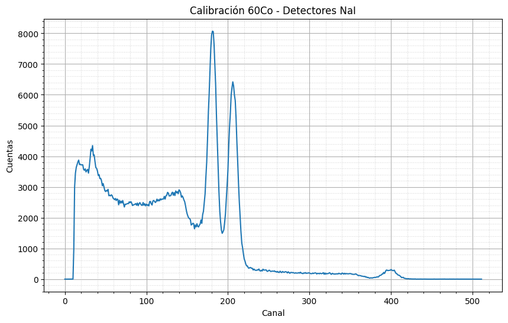
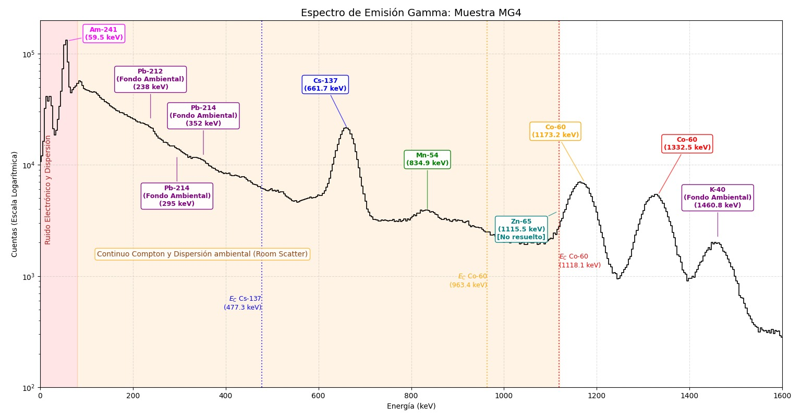
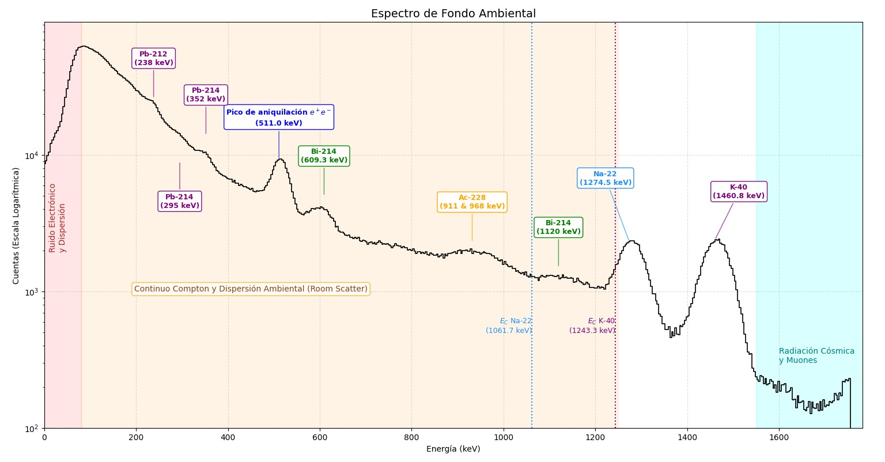
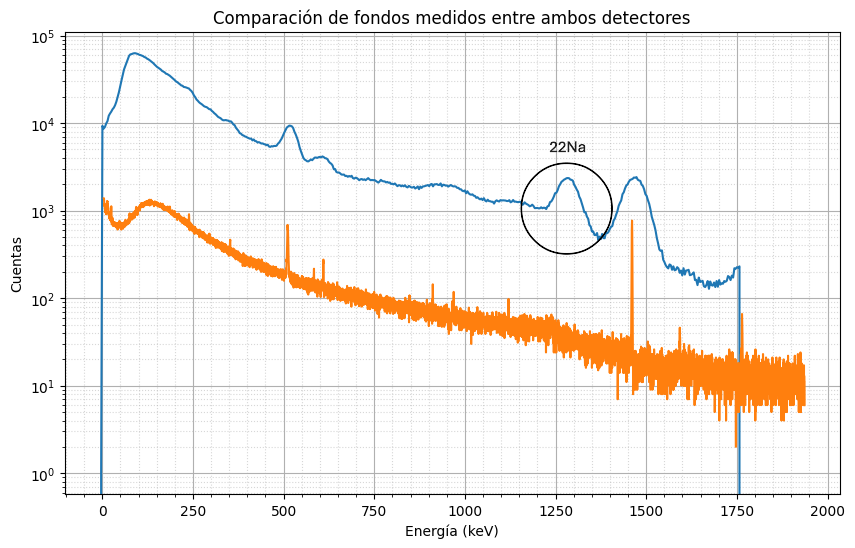
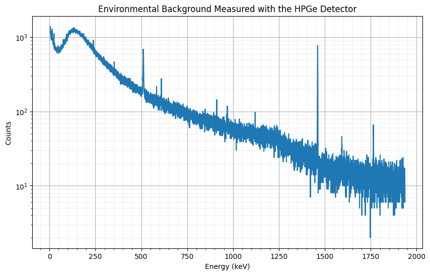
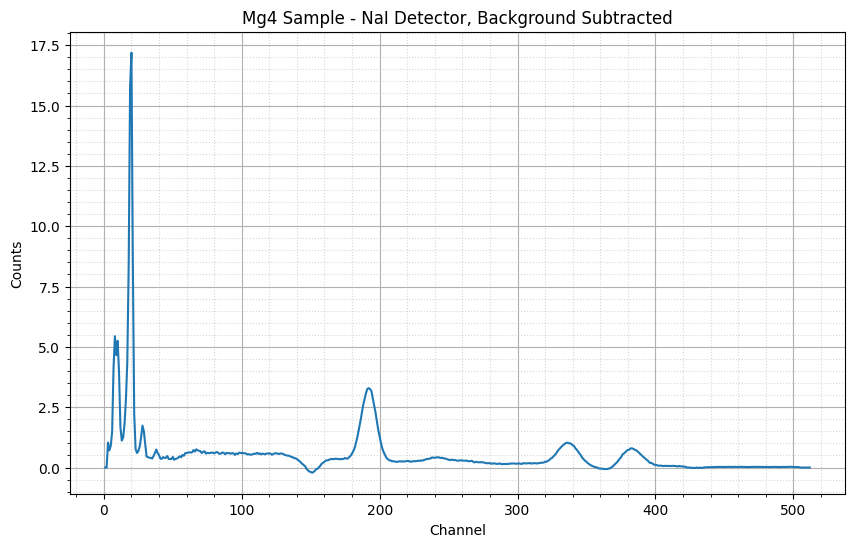
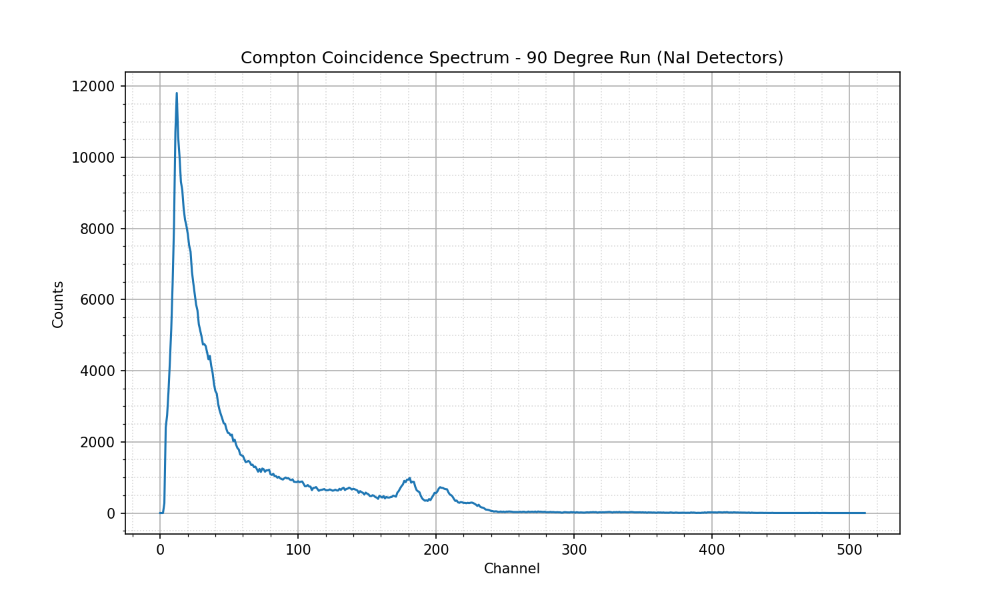

# Nuclear Spectroscopy Lab

Analysis code and data from two nuclear physics lab sessions: a **Compton-scattering
coincidence** experiment and a **gamma-ray spectroscopy** experiment. Both use the same
Fortran peak-fitting routine on top of raw multichannel-analyzer (MCA) spectra, with
Python/Jupyter notebooks for spectrum preprocessing and plotting.

## Repository layout

```
.
├── compton_coincidence/       Compton scattering angular-distribution experiment
│   ├── data/                  Raw MCA spectra (one count per line = one channel)
│   ├── figures/                60Co characterization plot (original, annotated)
│   ├── src/gaussian_fit.f     Peak-fit program (linear background + Gaussian)
│   └── analysis.ipynb         Coincidence spectrum plotting
│
├── gamma_spectroscopy/        NaI vs. HPGe gamma spectroscopy of an Mg sample
│   ├── data/                  Raw and background-subtracted spectra
│   ├── figures/                Detector comparison plots (original, annotated)
│   ├── src/gaussian_fit.f     Peak-fit program (same method as above)
│   └── analysis.ipynb         Background subtraction / spectrum plotting
│
└── results/                   Plots regenerated by actually running the code in
                                this repo (added during verification — see below)
```

## Method

Both `gaussian_fit.f` programs fit a single peak in a channel-vs-counts spectrum:

1. Read the spectrum (one or two columns: `[channel] counts`).
2. Fit a **linear background** through two bands flanking the peak (width equal to the
   peak window, one band on each side), via least squares.
3. Subtract that background from the counts inside the peak window, take `log(counts)`,
   and fit a **parabola** to it. A Gaussian's log is a parabola, so this recovers the
   peak's centroid, sigma, height, and area analytically — no nonlinear solver needed.
4. Propagate the background fit's covariance into the uncertainty of the log-counts
   before the parabola fit.

The peak window (`CHANMIN`/`CHANMAX`) is hardcoded at the top of `MAIN` in each file —
edit those two lines to fit a different peak. `LFIT`, `COVSRT`, and `GAUSSJ` are the
general linear least-squares routines from *Numerical Recipes in Fortran 77* (Press,
Teukolsky, Vetterling & Flannery); everything else is original.

### Build & run

Requires `gfortran`. From either `src/` directory:

```sh
gfortran -O2 -o gaussian_fit gaussian_fit.f
./gaussian_fit
```

The program reads its input spectrum via a hardcoded relative path (`../data/...`), so
run it from inside `src/`.

## Results

### Compton coincidence — `compton_coincidence/`

`gaussian_fit.f` fits the K-40 (1460.8 keV) reference peak in the calibration spectrum
`data/calibration-2.txt` (channels 193–222):

| Quantity | Value |
|---|---|
| Background points | 58 |
| Peak points | 18 |
| Centroid | 206.37 channel |
| σ | 3.68 channel |
| FWHM | 8.67 channel |
| Peak height | 9605.9 counts |
| Peak area | 88664.8 counts |



*⁶⁰Co characterization run used to calibrate the NaI coincidence detectors (original
annotated figure, committed with the repo).*

`data/` also holds the angular coincidence spectra themselves — one run per scattering
angle (22.5°, 45°, 67.5°, 90°, 112.5°, 135°, 157.5°, 180°), each with a `-2` repeat run,
plus `Na-*.txt` monitor spectra and `livetimes.txt` (per-detector live time counter
values for each angle, used to normalize coincidence counts before building the angular
distribution).

> Note: `data/167-2.txt` is an empty (0-byte) file — looks like an aborted or unsaved
> acquisition run, kept as originally recorded rather than deleted.

### Gamma spectroscopy — `gamma_spectroscopy/`

`gaussian_fit.f` fits the K-40 (1460.8 keV) background peak in the NaI background
spectrum, after background-subtracting an Mg-4 sample run against a blank run and
normalizing both by live time (done in `analysis.ipynb`, writing
`data/Mg4-NaI-background-subtracted.txt`), then fitting channels 14–22:

| Quantity | Value |
|---|---|
| Background points | 16 |
| Peak points | 7 |
| Centroid | 19.46 channel |
| σ | 1.27 channel |
| FWHM | 2.99 channel |
| Peak height | 15.51 counts |
| Peak area | 49.35 counts |



*Mg-4 sample gamma spectrum (NaI), with the identified peaks labeled — Cs-137, Mn-54, both
Co-60 lines, and the K-40 background peak fit above (original annotated figure).*



*Environmental background spectrum (NaI) — the natural decay-chain and cosmic-ray lines
subtracted from the sample spectrum above to isolate the Mg-4 signal.*



*NaI (blue) vs. HPGe (orange) background spectra on the same energy axis, showing the
HPGe detector's much better energy resolution.*

`data/` holds the raw NaI and HPGe spectra for the Mg-4 sample and their environmental
backgrounds; `Mg4-HPGe.txt` is the higher-resolution HPGe spectrum (16384 channels) of
the same sample.

## Verification — what was actually run for this write-up

Everything below was executed directly against the code in this repo (gfortran 
build + `jupyter nbclient` execution), not copied from the pre-existing figures above,
so it's an independent check that the pipeline actually reproduces its claimed results.

**Fortran fits — both reproduce the numbers in the tables above exactly:**

```
$ cd compton_coincidence/src && gfortran -O2 -o gaussian_fit gaussian_fit.f && ./gaussian_fit
 Center channel   :   206.374741      Sigma :   3.68233967
 FWHM (channels)  :   8.67117310      Height:   9605.88086
 Area             :   88664.7500

$ cd gamma_spectroscopy/src && gfortran -O2 -o gaussian_fit gaussian_fit.f && ./gaussian_fit
 Center channel   :   19.4558735      Sigma :   1.26961339
 FWHM (channels)  :   2.98968554      Height:   15.5057945
 Area             :   49.3463974
```

**`gamma_spectroscopy/analysis.ipynb` — runs cleanly end to end**, both cells execute
without error and regenerate `data/Mg4-NaI-background-subtracted.txt` byte-for-byte
(the only diff after re-running was a trailing newline). Fresh, unannotated plots from
this run are saved in `results/gamma_spectroscopy/`:



*Cell 1 output: HPGe environmental background on a log scale, re-plotted directly from
`data/background-HPGe.txt`. Same shape/peaks as the annotated `figures/background-hpge.png`
above (40K line at ~1460 keV, decay-chain lines below 800 keV), just without the isotope
callouts — confirms the underlying data and pipeline match the original figure.*



*Cell 2 output: Mg-4 sample spectrum after live-time-normalized background subtraction,
freshly computed by this run of the notebook (not copied from `figures/`).*

**`compton_coincidence/analysis.ipynb`** loads `data/90.txt` (the 90° coincidence run)
and plots it:



*Raw coincidence spectrum for the 90° run.*

Environment used for this verification: `gfortran` (system default), Python 3.10,
`numpy` 1.26.4, `matplotlib` 3.10.8, `nbclient` 0.10.4 — all already present, no
installation was needed.

## Notes

- Originally written with Spanish comments, identifiers, and filenames (the lab's
  working language); everything has been translated to English. The `LISTA` argument
  in `LFIT`/`COVSRT` is the one exception — that name comes straight from the
  *Numerical Recipes* book itself, not from the original author, so it was left as
  published rather than renamed.
- Spectra are plain text, one row per channel — either `counts` or `channel  counts`,
  see each program's `read` statement for the exact format it expects.
- `compton_coincidence/data/livetimes.txt`: angles and live times were originally
  written with Spanish-locale numbers (`,` as decimal separator, `.` as thousands
  separator). Angles were converted straightforwardly (`157,5` → `157.5`). The
  characterization run's live times (`351.308`, `351.291`) were interpreted as
  thousands-separated integers (`351308`, `351291`) to match the order of magnitude of
  the other live-time values in the file — worth double-checking against the original
  lab notes if that run's live time matters for your analysis.
